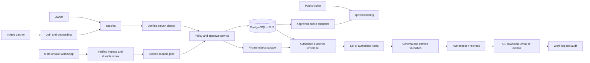

# KXRA FINAL COMPLETION BRIEF

KXRA Group and KXRA OS · Requirements freeze and execution contract · Version 1.0 · 14 September 2026

## Document authority and evidence boundary

This document freezes the remaining Phase 1 and production-readiness requirements. It consolidates, without replacing or weakening:

1. `KXRA-GENESIS/CODEX-GENESIS-BUILD-BRIEF.md`, version 1, 11 September 2026;
2. `docs/operations/CODEX-PHASE-COMPLETION-BRIEF.md`, 13 September 2026;
3. `docs/operations/acceptance-evidence.md`, reviewed 14 September 2026; and
4. the owner completion addendum dated 14 September 2026.

If the sources conflict, the later explicit owner instruction governs. Requirements not repeated here remain in force. The private `KXRA-GENESIS` package is preserved and is not rewritten by this freeze.

The reviewed implementation checkpoint is commit `0c20de47fe1f6cb38646db51c4a90650679aacd7`. The branch was clean at documentation commit `e9e317a41b0f7a64f4b652152f7ef7c2a5ef3781` when this freeze was prepared. The Phase Completion Brief is authoritative evidence of the reviewed baseline; the acceptance ledger is authoritative evidence of the subsequent AT-01 through AT-09 remediation. Neither document is evidence that later requirements work.

The owner addendum refers to “existing A1–A8 acceptance tests.” The authoritative Phase Completion Brief actually defines **AT-01 through AT-18**. To avoid silently dropping tests, this contract preserves all AT-01 through AT-18 and adds AT-19 through AT-30. The Genesis **eight operating foundations** remain architectural requirements; they are not substituted for acceptance tests.

## Completion rule

A route, row, schema, disabled button, placeholder registry, fake provider, passing unit helper or screen label does not make a feature complete. A feature is complete only when all seven conditions are evidenced:

1. the real user workflow works end to end;
2. authorization is enforced at the database and HTTP/delivery boundaries;
3. required failure, expiry, revocation, retry and recovery states work;
4. the complete relevant automated and manual test set passes;
5. the workflow is usable on desktop and mobile;
6. current operating, security and user documentation exists; and
7. a reviewer has verified the behavior against the actual implementation and recorded evidence.

Every test result must be recorded as `PASS`, `FAIL`, `BLOCKED` or `NOT RUN`, with the reviewed commit, environment, date, exact command or scenario, and durable artifact. `PASS` applies only to the tested environment. A local fake-provider pass is not a hosted-provider pass. A missing credential or external approval is `BLOCKED`, never `PASS`.

## 1. FINAL REQUIREMENT DELTA

The Genesis brief and Phase Completion Brief remain the base contract. The following requirements are mandatory additions or explicit expansions.

| ID    | Area                             | Frozen requirement delta                                                                                                                                                                                                                                                                                                                                                                                                                         |
| ----- | -------------------------------- | ------------------------------------------------------------------------------------------------------------------------------------------------------------------------------------------------------------------------------------------------------------------------------------------------------------------------------------------------------------------------------------------------------------------------------------------------ |
| FR-01 | Partner account and invitation   | Invitation-only access; no public registration and no owner-issued default password. Owner selects email, one or more projects, role per project, optional note and expiry. The partner creates and confirms their own password. The invitation token survives all required auth/email-verification transitions, the email is locked to the invitation, and redemption is one-use, expiring and audited.                                         |
| FR-02 | Account lifecycle                | Store and enforce equivalent lifecycle states `INVITED`, `REGISTERED`, `EMAIL_VERIFIED`, `ONBOARDING`, `ACTIVE`, `SUSPENDED`, `REVOKED`. Expired/revoked invitations and suspended/revoked accounts fail closed. Lifecycle transitions are server-controlled and auditable.                                                                                                                                                                      |
| FR-03 | Partner onboarding               | First join launches a polished mandatory nine-step wizard: Welcome; Personal Profile; Security; Project Access; Working With KXRA; optional WhatsApp; Preferences; Terms/Privacy/required agreements; Complete. Store `onboarding_completed_at`; incomplete users return to onboarding after login.                                                                                                                                              |
| FR-04 | Partner account management       | Partners can edit permitted profile fields, change/reset password, manage MFA, notification preferences, WhatsApp pairing, inspect assignments/status, and sign out all sessions where supported. They cannot change role, organisation, projects, restrictions or permissions.                                                                                                                                                                  |
| FR-05 | Owner account management         | Owner can invite/resend/revoke, inspect invitation state, suspend/reactivate/revoke organisation access, add/remove assignments, change project role, force sign-out/revoke sessions where supported, and unpair WhatsApp. Every consequential mutation uses current authority, recent AAL2 and an exact approval where the policy requires it.                                                                                                  |
| FR-06 | Owner bootstrap                  | Production owner uses hosted authentication and an audited one-time bootstrap. MFA is mandatory before production. Fixture identity/authentication code is excluded from production artifacts and remains possible only in explicitly isolated local/test mode.                                                                                                                                                                                  |
| FR-07 | Owner Dashboard                  | Dashboard is an operating view, not a Portfolio duplicate. It includes `TODAY`, `NEEDS YOUR DECISION`, `AT RISK`, and `RECENT ACTIVITY`, backed by portfolio status, attention items, approvals, validation experiments, critical risks, decisions, partner/AI activity, failed routines, blocked work, available finance, recent ideas, gates, warnings and security events.                                                                    |
| FR-08 | Portfolio                        | All ventures show stage, status/disposition, Venture Score, Confidence Score, owner, partners, capital used, next gate, largest risk, latest experiment and current recommendation. Sorting/filtering is required. Unknown or incomplete scores remain `NOT ASSESSED`/null and are never fabricated or ranked by an invented midpoint.                                                                                                           |
| FR-09 | Project workspaces               | Replace generic project pages with common tabs and project-specific modules listed in “Project workspace contract” below. The tabs must be backed by typed data/workflows or truthfully labelled unavailable; navigation alone is not completion.                                                                                                                                                                                                |
| FR-10 | Idea Inbox                       | Owner inbox is group-wide. A partner sees only their own submissions or ideas explicitly shared with them. Ideas store submitter/date/raw idea/structured summary/problem/customer/project/evidence/validation/scores/next experiment/status and use the frozen state set below.                                                                                                                                                                 |
| FR-11 | Ask KXRA                         | Permission-safe AI flow is authenticate → authorize → choose one project/scope → retrieve only authorized records/chunks → synthesize → validate citations/output → recheck authorization → deliver → log. A multi-project partner must select exactly one project; no mixed “all projects” answer. Missing evidence returns `INSUFFICIENT KXRA EVIDENCE.` Answers link to authorized internal sources.                                          |
| FR-12 | Knowledge/files                  | Implement `QUARANTINE`, `CLEAN`, `EXTRACTED`, `INDEXED`, `FAILED`/`REJECTED`; validation, MIME/magic checks, size/expansion/macro controls, trusted scanning design, isolated extraction, versioned chunks, object storage, inherited RLS, source/version metadata and authorization-checked downloads. Revocation before delivery blocks bytes.                                                                                                 |
| FR-13 | AI Team                          | Convert definitions into on-demand, typed, permission-scoped capabilities. Implement the executive and specialist capability set below. Every role has manager, description, scope, allowed tools, memory/context scope, permission profile, QA, success criteria, approval boundary and model policy/version. Do not run every agent continuously.                                                                                              |
| FR-14 | Skills                           | Skills are executable controlled capabilities with lifecycle `DRAFT`, `SUPERVISED`, `TESTING`, `APPROVED`, `AUTOMATED`, `MONITORED`, `NEEDS_REVIEW`, `RETIRED`. Each version defines when to use, inputs, connections, ordered steps, rules, tool allowlist, validation, output schema, failure handling and approval boundary. Untested skills cannot be automated.                                                                             |
| FR-15 | Routines                         | Real `MANUAL`, `SCHEDULED` and `EVENT_TRIGGERED` routines support timezone/DST, idempotency, retries, checkpoints, budgets, authority recheck, notifications, history and pause/disable. All existing routines remain disabled until individually approved.                                                                                                                                                                                      |
| FR-16 | AI runs/handoffs                 | Authoritative `agent_runs`, append-only `run_steps`, structured `handoffs`, budget reservations and usage/cost records are required. Runs are attributable to initiator, scope, model/skill/policy versions and actual outcomes. Enforce delegation depth and budget; prevent loops and forged completion.                                                                                                                                       |
| FR-17 | Approvals                        | Add exact approval workflows for record acceptance, membership, project gates, publish, external message, spend, deployment, high-cost AI runs and configured consequential actions. UI shows action, requester, project, before/after, recipient, estimated cost, risk and expiry.                                                                                                                                                              |
| FR-18 | Work Log                         | Native log types are `WORK_ITEM`, `ROUTINE_RUN`, `AI_RUN`, `HANDOFF`, `SYSTEM_EVENT`, `AUDIT_EVENT`. Owner filters by project, person/agent, department, type, status and date. Entries link to real artifacts/state changes; no simulated activity.                                                                                                                                                                                             |
| FR-19 | WhatsApp                         | Complete pairing, unpairing, project selection, conversation/message/media handling, appropriate voice transcription, supported intents, takeover, outbox, delivery state, deduplication and reconciliation. Authorization precedes retrieval. WhatsApp can never approve membership, spending, publication, deployment or live trading. Fake transport precedes any separately authorized Meta staging transport.                               |
| FR-20 | Marketing app                    | Create independently buildable/deployable `apps/marketing`; keep `apps/os` private and separately deployable. Target domains are `www.kxra-group.com` and `app.kxra-group.com`. Required routes are `/`, `/approach`, `/explorations`, `/partner`, `/submit-opportunity`, `/contact`, `/privacy`, `/terms`, `/login`; login sends users to the private OS. Only explicitly approved publication records enter public output.                     |
| FR-21 | Public forms                     | Partner enquiry, opportunity submission and contact workflows must really submit using validation, rate limits, accessible bot/spam controls, owner-private safe storage and an audit trail. Submissions remain unverified inbound claims, never accepted company facts.                                                                                                                                                                         |
| FR-22 | Analytics/monitoring             | Integrate PostHog and Sentry with data minimization, opaque identifiers, safe allowlists and redaction. Do not send confidential project content, prompts, messages, file bodies, secrets or private session replay unnecessarily.                                                                                                                                                                                                               |
| FR-23 | Email                            | Implement approved-provider transactional delivery and the templates: Partner Invitation, Invitation Reminder, Password Reset, Email Verification when applicable, Welcome, Security Alert, Project Assignment, Access Removed and Approval Required when appropriate. Delivery, bounce/failure and retry state are observable.                                                                                                                  |
| FR-24 | CI/CD                            | GitHub CI creates its own disposable services and runs format, lint, typecheck, unit, integration, authorization, database, E2E, marketing build, OS build and security-sensitive checks. Tests are hermetic; stale local processes cannot make CI pass. Deployment remains separately approved.                                                                                                                                                 |
| FR-25 | Backup/restore                   | Document database and object-storage backup, retention and restore procedures. Perform and record a synthetic restore into an empty target before production; verify counts, hashes, ACLs, source versions and pending-job/outbox state.                                                                                                                                                                                                         |
| FR-26 | Accessibility/responsive         | Test 1440px, 768px, 390px, 320px and 200% zoom. Replace horizontal owner mobile navigation with an accessible mobile model. Verify keyboard, focus, forms, errors, dialogs, tables and practical screen-reader behavior against WCAG 2.2 AA.                                                                                                                                                                                                     |
| FR-27 | Required UX states               | Every important screen/workflow implements loading, empty, success, validation failure, authorization denial, network failure, retry and expired/revoked states; users are not left on blank or broken interfaces.                                                                                                                                                                                                                               |
| FR-28 | Platform administration/security | Owner Admin controls users, partners, invitations, memberships, security policies, budgets, connections, routines, retention, backups, environment/integration state, audit data and health. Apply rate limits, idempotency, CSP, safe errors, SSRF defenses, webhook verification, upload validation, Storage RLS, session revocation, real AAL2, secret management, prompt-injection/model-output tests and delivery-time permission rechecks. |

## 2. FINAL ARCHITECTURE

### 2.1 Non-negotiable trust model

- PostgreSQL is authoritative for identity mapping, memberships, data scope, approvals, lifecycle state, budgets, workflows, deduplication, runs, audit and delivery intent.
- Supabase Auth owns password credentials and hosted authentication factors. KXRA never stores, generates, emails or displays a partner password.
- Every request begins with a verified server identity and performs database work in a transaction under the authenticated RLS role. Browser bodies, webhook payloads and model output never establish user ID, role, organisation, project access or approval.
- Partner visibility requires active organisation membership, active/unexpired project membership and an explicitly shared parent record. Children, files, chunks, search indexes, caches, summaries, AI context and derived outputs inherit the most restrictive parent scope.
- Authorization happens before retrieval or tool selection and again before execution, byte delivery and message delivery. Revocation increments `access_version`, invalidates dependent sessions/caches/capabilities and cancels or withholds queued outputs.
- Accepted decisions, approvals, audit events, run steps and material history are immutable or append-only. Corrections create linked superseding versions.
- Exact money arithmetic runs in deterministic code/database functions, never in a model. Native currencies and actual/commitment/estimate/paper amounts remain distinct.
- Project 004 live execution is permanently absent for this release. Project 005 creation/publication remains behind reviewed demand and owner approval gates.
- External source text, file contents, messages and model output are untrusted data. They cannot alter policy, tools, scope, approvals or system prompts.

The eight Genesis operating foundations remain required and map to production evidence as follows:

| Foundation   | Required production evidence                                                                              |
| ------------ | --------------------------------------------------------------------------------------------------------- |
| Context      | Authorized answers cite exact current record/file versions.                                               |
| Connections  | Each connected provider has an approved purpose/scope, health check, revocation path and secret boundary. |
| Capabilities | Each agent/skill has typed input/output, permissions and passing evals.                                   |
| Cadence      | Each due event produces at most one durable outcome and only meaningful notification.                     |
| Control      | Consequential actions cannot execute without current exact authority and budget.                          |
| Confidence   | Scores retain evidence, uncertainty, conflicts and unknowns.                                              |
| Compliance   | Rights, privacy, policy, jurisdiction and professional-review gates are current for the action.           |
| Continuity   | An operator can reconstruct state and a database-plus-object restore drill passes.                        |

### 2.2 Deployable units

| Unit                    | Responsibility                                                               | Public-data rule                                                                                            |
| ----------------------- | ---------------------------------------------------------------------------- | ----------------------------------------------------------------------------------------------------------- |
| `apps/os`               | Private owner and partner UI, join/onboarding, server APIs                   | No private record is client-bundled without current authorization.                                          |
| `apps/marketing`        | Public site and public forms                                                 | Build consumes only versioned, owner-approved publication snapshots; it has no private database credential. |
| `packages/domain`       | Typed state machines, validation, scoring and deterministic finance          | No arbitrary JSON business-state bypass.                                                                    |
| `packages/authz`        | Resource policies, capability contracts, revocation                          | Default deny; no client/model authority.                                                                    |
| `packages/db`           | Typed queries and RLS transactions                                           | Non-owner, non-BYPASSRLS application role.                                                                  |
| `packages/ai`           | Evidence envelopes, model adapters, tool broker and evals                    | Narrow calls only; no raw SQL/shell/unrestricted URL fetch.                                                 |
| `packages/integrations` | Resend, Meta, telemetry and provider adapters                                | Fake/local adapters first; secrets are server-only.                                                         |
| `jobs`                  | Durable extraction, research, routines, delivery and reconciliation          | Short-lived scoped capability, current-authority recheck and idempotency.                                   |
| `supabase`              | Additive migrations, RLS/storage policies, test fixtures                     | Applied migrations are never rewritten.                                                                     |
| `tests`                 | Unit, SQL, HTTP, integration, E2E, accessibility, eval and recovery evidence | Disposable/hermetic environments in CI.                                                                     |
| `ops` and `docs`        | Bootstrap, incident, backup, restore, deploy, rollback and handover          | Procedures distinguish implemented, verified and blocked.                                                   |

### 2.3 Identity, invitation and onboarding model

Use separate but related invitation and account lifecycle state machines.

**Invitation states:** `PENDING`, `SENT`, `DELIVERY_FAILED`, `REDEEMED`, `EXPIRED`, `REVOKED`. Resend creates a new delivery attempt without changing the approved grant. A material project/role/expiry change creates a new invitation version and invalidates old links.

**Account states:** `INVITED`, `REGISTERED`, `EMAIL_VERIFIED`, `ONBOARDING`, `ACTIVE`, `SUSPENDED`, `REVOKED`. These are server-controlled projections of verified Auth state plus KXRA membership/onboarding state. `SUSPENDED` and `REVOKED` override every earlier state.

Required records include:

- `profiles`: Auth subject, permitted profile fields, account state, status reason, timestamps and `onboarding_completed_at`;
- `invitations`: normalized email digest, token digest, note, expiry, state, issuer, resend/revoke/redemption audit, exact approval/version;
- `invitation_project_grants`: one or more project/role grants bound to the invitation version;
- `onboarding_progress`: required/current step and server-validated completion state;
- `user_preferences`: timezone and notification preferences, including WhatsApp only when paired;
- `agreement_documents`: admin-configured document key/version/status/content reference; legal text may remain an explicitly unapproved placeholder;
- `agreement_acceptances`: user, exact document version, acceptance timestamp and request/audit identity;
- provider-backed authentication factors/sessions, with no passwords in KXRA tables.

Invitation flow:

1. Recent-AAL2 owner selects normalized email, projects, role per project, optional note and expiry.
2. Server validates current owner authority and exact projects/roles, creates a one-use token, stores only its digest, records approval/audit state and queues a transactional email.
3. The branded Join page exchanges the raw token for a short-lived, HTTP-only, same-site join intent. Raw tokens are not placed in logs, analytics or persistent browser storage.
4. Join locks the displayed/account email to the invitation. No public path can select an organisation, project or role.
5. The partner creates and confirms their password through hosted Auth. Email verification is completed when the configured provider requires it. Redirects, refreshes and sign-in retain the join intent safely.
6. Redemption transaction locks invitation/version, verifies token, expiry, state, verified identity email and current grant authority, then creates exactly the approved memberships once.
7. The account enters `ONBOARDING`. Mandatory app destinations redirect back to the wizard until all required steps and agreements are complete.
8. Completion stores `onboarding_completed_at`, transitions to `ACTIVE`, sends Welcome, shows only assigned projects and begins the product tour.

Onboarding steps are exactly:

1. **Welcome to KXRA** — explain KXRA and granted access.
2. **Personal Profile** — first/last name, title, employer/company profile field, appropriate phone, optional profile image. This editable profile field is not the authoritative KXRA organisation membership, which the partner cannot change.
3. **Security** — confirm email/password state; offer or enforce MFA according to policy; explain security.
4. **Project Access** — assigned projects only, with project name, partner role, high-level summary and effective permissions; read-only membership.
5. **Working With KXRA** — My Projects, Ask KXRA, Ideas, Tasks, Files, Activity and WhatsApp.
6. **WhatsApp** — connect now or skip; pairing is optional and remains available later.
7. **Preferences** — email, connected-WhatsApp and other notification preferences, timezone and basic display/profile preferences.
8. **Terms / Privacy / Required Agreements** — accept exact configured versions; do not fabricate legal/NDA text.
9. **Complete** — show assigned projects, short guided tour and dashboard entry.

### 2.4 Owner and partner experience

Owner navigation retains: Dashboard, Portfolio, Idea Inbox, Projects, Research, Experiments, Decisions, Risks, Finance, Partners, WhatsApp, AI Team, Skills, Routines, Run History, Work Log, Approvals, Knowledge, Assets, Admin.

Partner navigation retains: Home, My Projects, Ask KXRA, Ideas, Tasks, Files, Activity, WhatsApp Connection, Profile. The mobile owner and partner experiences use an accessible drawer/menu or equivalently appropriate model; no horizontal navigation overflow.

The Owner Dashboard contains four primary sections:

- `TODAY`: due gates/tasks, scheduled work and meaningful changes;
- `NEEDS YOUR DECISION`: approvals, proposed decisions and gate requests;
- `AT RISK`: critical risks, blocked work, failed routines, security/system warnings;
- `RECENT ACTIVITY`: partner activity, AI activity, decisions, ideas and project events.

Portfolio provides sortable/filterable rows/cards for all ventures with stage, status/disposition, score, confidence/coverage, owner, partners, capital used, next gate, largest risk, latest experiment and recommendation. Financial or score values without evidence render `Unknown`/`NOT ASSESSED`.

Idea states are `NEW`, `TRIAGE`, `VALIDATING`, `PROMISING`, `BUILDING`, `PAUSED`, `REJECTED`, `ARCHIVED`. Partner queries are limited to `submitted_by=current_user` or an explicit authorized share; assignment alone does not reveal the group-wide inbox.

### 2.5 Project workspace contract

Every project provides these common tabs: Overview, Problem, Customer, Value Proposition, Market, Research, Assumptions, Experiments, Decisions, Risks, Finance, Roadmap, Tasks, Files, Activity, Metrics, Partners, Approvals.

| Project                                         | Required specialist modules and hard boundaries                                                                                                                                                                                                                                                                                                                                      |
| ----------------------------------------------- | ------------------------------------------------------------------------------------------------------------------------------------------------------------------------------------------------------------------------------------------------------------------------------------------------------------------------------------------------------------------------------------ |
| PROJECT-001 — CLPR                              | Technical Research; Architecture / Interoperability; Competitive Landscape; Regulatory; Commercial Case; Revisit Criteria; Red Team; Scorecard. Monitoring/research only until the Genesis route, liquidity, recovery, buyer and regulatory conditions are evidenced.                                                                                                                |
| PROJECT-002 — US Vehicle Seat Covers            | Product Catalogue; Supplier Evidence; Fitment Matrix; Vehicle Compatibility; Safety / Airbag Evidence; Creative Assets; Marketplace; eBay Listings; Pricing; Competitors; Unit Economics; Orders / Performance when available. Seed Ford F-150, Ram/Dodge Ram and Toyota Tacoma families with unknown fit-critical fields. Never infer verified fitment or safety.                   |
| PROJECT-003 — AI Property Fly-Through           | Property Inputs; Floorplans; Photos; Source Assets; POC Pipeline; Technology Evaluation; Accuracy QA; Demo Library; Estate Agent Validation; Pricing; Packages; Leads / Feedback. Mark real property information separately from AI-generated/inferred material; fidelity/rights gates apply.                                                                                        |
| PROJECT-004 — AI Trading Research & Monitoring  | Research; Market Calendar; Watchlist; Strategy; Readiness; Paper Account; Historical Data; Paper Experiments; Risk Ledger; Schedule; Run History; Midday Reports; After-Close Reports. Paper/research only; no live adapter, credential, toggle or approval path.                                                                                                                    |
| PROJECT-005 — Digital Products & Content Engine | Market Discovery; Trend Research; Opportunity Backlog; Opportunity Scores; Competitor Research; Customer Complaints / Gaps; Product Briefs; Production Pipeline; Assets; Compliance / IP; QA; Marketplace Listings; Publishing Approvals; Sales Analytics; Product Portfolio; Experiments. Creation stays behind evidence/approval gates; publication has a separate exact approval. |

### 2.6 Files, knowledge and Ask KXRA

File lifecycle transitions are server controlled:

`QUARANTINE → CLEAN → EXTRACTED → INDEXED`

Any stage may terminate in `FAILED` or `REJECTED` with a safe reason and retry policy. Only a trusted scanning worker may mark `CLEAN`; only versioned extraction may create chunks; only eligible current chunks enter retrieval. Object storage is private. Downloads use an authorization-checked proxy or a tightly bounded signed URL after a delivery-time recheck.

Ask KXRA uses an explicit evidence envelope. Owner scope is limited to owner-authorized KXRA knowledge. A partner with more than one assigned project selects exactly one project before retrieval. The server validates every cited record/chunk/version and rejects stale or inaccessible citations. An authorization change between retrieval and delivery withholds the answer. Missing evidence returns exactly `INSUFFICIENT KXRA EVIDENCE.` A redacted durable run log records requester, project, query classification, evidence IDs/versions, model/policy version, result state and failure without exposing secrets or unrelated content.

### 2.7 AI, skills, routines and audit

Executive capabilities are: KXRA Chief of Staff, COO, CFO Analyst, CMO and CTO/Engineering Coordinator.

Specialist capabilities are: Research, Venture Validation, Competitor Intelligence, Red Team, Financial Modelling, QA, Security, Content, Creative/Design, SEO, E-commerce, Partner Operations, Meeting Intelligence, Project Reporting, Digital Product Research, Digital Product Creation, Marketplace Compliance and Growth Analytics. Project-specific Genesis specialists may remain as typed specializations of this set.

Agents and skills are versioned manifests; only approved versions can be invoked. The initiating principal's narrower scope is inherited. Tool calls go through a deterministic broker. Default chargeable budget is zero. Sol is the default partner model route; Astra requires explicit scoped escalation and budget. An unavailable model is a blocker, not permission to substitute.

Run states retain `QUEUED`, `AUTHORIZED`, `RUNNING`, `WAITING_APPROVAL`, `COMPLETED`, `FAILED`, `CANCELLED`, `RECONCILIATION_REQUIRED`. Every attempt has append-only steps, lease/checkpoint, usage and handoff. Default delegation depth remains at most two levels below Chief of Staff unless a separately approved policy version changes it. Direct agent-to-agent cycles are rejected.

Routines support manual, scheduled and event-triggered dispatch, but every imported routine starts disabled. Activation binds exact scope, timezone/calendar, deduplication key, budget, retries, notification policy and approval version. Quiet-on-unchanged is the default.

The Work Log is a typed projection over real work, runs, handoffs and audit events; it is not a free-form claim that work occurred.

### 2.8 Approvals and administration

Approval flow remains `DRAFT → REQUESTED → APPROVED/REJECTED/EXPIRED → EXECUTING → EXECUTED/FAILED`, with `RECONCILIATION_REQUIRED` for uncertain external outcomes. The canonical envelope binds action, organisation, project, target/current version, complete before/after payload, requester, recipient, estimated maximum cost, risk, environment and expiry. Recent AAL2 owner approval is one-use. Execution locks and revalidates current authority, membership/access version, payload hash and budget.

Owner Admin exposes controlled views/actions for profiles/accounts, invitations, memberships, security policy, model/AI budgets, connections, routines, retention, backup/restore evidence, integration/environment state, audit data, incidents and health. It does not expose secrets or a generic mutation console.

### 2.9 External channels and public boundary

WhatsApp uses the Genesis pairing/ingress/outbox design and fake transport first. Each inbound message resolves a verified pairing and one explicit project before retrieval. Duplicate events create one logical result. Human takeover cancels queued AI sends. Ambiguous delivery enters reconciliation. Membership, spending, publication, deployment and trading approvals are portal-only.

Permitted WhatsApp intents are idea creation, project question/discussion, project status, validation request, research request, note, task proposal, supported document/image ingestion, appropriate voice-note transcription and human-help/takeover. Each produces a typed server-side proposal or action within the selected project; none creates approval authority.

Transactional email uses a provider adapter and durable outbox. Templates are versioned; invitation links are single-purpose. Send, provider acceptance, delivery/bounce where available, retry, cancellation and permanent failure are recorded. Security-sensitive email contains no private project body.

The marketing application has no import path to private runtime records. Public ventures are rendered from immutable approved publication snapshots. Form submissions enter an owner-only unverified inbox with source classification, rate-limit result and audit trail. The public artifact scan covers HTML, JavaScript, source maps, metadata and static assets.

PostHog and Sentry receive only documented allowlisted fields. Session replay/autocapture and text capture remain off in private areas unless a later privacy/security review explicitly authorizes a safe configuration.

## 3. IMPLEMENTATION MILESTONES IN EXACT ORDER

Later implementation may prepare inert types/tests, but a later capability must not be activated or called complete before its predecessor's local exit gate passes. Hosted/provider evidence is collected in Milestone 11; absence of credentials must not stop safe independent local work.

| Order | Milestone                                                 | Required implementation                                                                                                                                                                   | Local exit tests                                                | Production dependency                                                            |
| ----: | --------------------------------------------------------- | ----------------------------------------------------------------------------------------------------------------------------------------------------------------------------------------- | --------------------------------------------------------------- | -------------------------------------------------------------------------------- |
|     1 | Production identity, invitations, onboarding and accounts | FR-01 through FR-06 plus fake email/Auth provider contracts and all account UX                                                                                                            | AT-01, AT-02, AT-03 local subset, AT-19, AT-20, AT-21           | Hosted Auth/email/MFA and owner bootstrap verified in AT-30                      |
|     2 | Owner control plane and operating surfaces                | Expanded approvals, Admin, Dashboard, Portfolio, Idea Inbox, account security events and exact counts                                                                                     | AT-01, AT-02, AT-07, AT-22, AT-24                               | Real AAL2/external executors remain gated                                        |
|     3 | Useful project-specific workspaces                        | Common tabs, specialist modules, typed workflows, scores/gates and truthful unknown states for all five projects                                                                          | AT-05 through AT-09, AT-23                                      | Venture evidence/assets and owner gate decisions                                 |
|     4 | Secure file and knowledge lifecycle                       | Private object adapter, scanner contract, extraction, chunks, indexing, delivery and reconciliation                                                                                       | AT-04, AT-10                                                    | Hosted Storage/scanner verified in AT-30                                         |
|     5 | Permission-safe Ask KXRA                                  | One-project partner selection, evidence envelope, citations, logs, revocation-safe delivery and model adapter                                                                             | AT-11                                                           | Paid/hosted model access verified in AT-30                                       |
|     6 | AI execution substrate                                    | Typed agents/skills, tool broker, runs/steps/handoffs, budgets, usage, model policy and loop limits                                                                                       | AT-12, AT-13                                                    | Approved budgets/provider entitlements                                           |
|     7 | Routines, Work Log integration and notifications          | Manual/scheduled/event runs, DST/calendar, retries/checkpoints, notification intents, routine/run/handoff/system-event integration with the Work Log, filters and approval-required email | AT-14, AT-24 regression, AT-25                                  | Trigger/email provider staging verification                                      |
|     8 | WhatsApp fake transport                                   | Pair/unpair, project selection, ingress, media/transcription contracts, intents, outbox, takeover and reconciliation                                                                      | AT-15, AT-16                                                    | Meta eligibility, account and staging authorization in AT-30                     |
|     9 | Independent marketing and public forms                    | `apps/marketing`, all public routes, approved snapshots, three forms and private-marker scan                                                                                              | AT-17, AT-26                                                    | Legal text, public copy, mailbox/domain and publication approval                 |
|    10 | Cross-cutting production quality                          | Safe telemetry, security hardening, hermetic CI, full responsive/accessibility/failure-state suite, backup/restore and runbooks                                                           | AT-18, AT-27, AT-28, AT-29                                      | Provider contracts, retention and recovery choices                               |
|    11 | Controlled staging verification and release decision      | Hosted Auth/MFA/Storage, Resend, model, Trigger, Meta when eligible, PostHog/Sentry and deployment configuration; final evidence review                                                   | AT-30 plus rerun AT-01 through AT-29 in production-like staging | Explicit owner credentials, budgets, legal/policy decisions and release approval |

Milestone completion does not authorize production deployment, public publication, external messaging, paid calls or spending. Final production readiness requires AT-30 and every applicable earlier test to pass in the production-target configuration.

## 4. ACCEPTANCE TESTS

### 4.1 Preserved Phase tests

These tests retain their Phase Completion Brief meaning and apply to every new table, route, worker, cache and delivery path added later.

**AT-01 — Full access matrix.** Owner O; P002 contributor A; P003 viewer B; revoked P002 user C; separate-organisation user X; anonymous N. Populate every table with shared/private/group/other-org data. Exercise SELECT/INSERT/UPDATE/DELETE, every exposed RPC, API, file, search, citation, count, cache, job and delivery. N gets no private rows and 401 at private HTTP; A cannot discover other projects/owner-only data; B cannot write; C has no project content; X cannot cross organisations. Forged identity, role, scope, author and visibility fail generically. **Current status: PASS for the current 20-table local surface; mandatory regression extension for every milestone.**

**AT-02 — Current approval authority.** Reproduce old approved grant G → later approved/executed revocation R → execute G. G fails stale and access remains revoked. Mutation of target version, action, project, recipient, cost, risk, environment, expiry or contents invalidates the approval; canonical key reordering does not. Two concurrent executions produce one state change/audit outcome. Rejected, expired and consumed approvals fail at SQL and HTTP. **Current status: PASS for implemented executors; rerun for each new executor.**

**AT-03 — Real identity contract.** Invitation mismatch, reuse, expiry and revocation fail; verified identity receives only approved grants. No public signup can create KXRA membership. AAL1/stale step-up cannot approve; recent AAL2 can. Fixtures fail closed in production/Vercel/non-loopback/hosted configurations or with missing/weak secret. Hosted MFA enrollment/challenge/recovery, email verification, password reset, owner bootstrap and session revocation are exercised in staging. **Current status: BLOCKED; local legacy subset PASS, hosted and expanded workflow not complete.**

**AT-04 — Private uploads.** Owner-private is default; partner cannot discover private filename, record, hash, search result or route. Explicit share is visible only to current assignees. Partner cannot target an unassigned project, choose a storage key/authority or promote scan state. Selected project/audience is unambiguous before submit. **Current status: PASS for quarantine metadata; byte lifecycle remains AT-10.**

**AT-05 — Safe seed/provenance.** Fresh import yields exactly PROJECT-001–005, null scores, no real partner grants and expected approved registry definitions. Repeat/reorder is stable. Accepted directives cannot be overwritten. Unknown scopes/references or altered sources fail; injected mid-import failure commits nothing. Preserve codes, versions and hashes; never fabricate authors. **Current status: PASS locally.**

**AT-06 — Classification/history.** SQL and HTTP cannot promote to FACT without the allowed reviewed transition and evidence. Every version retains classification, status, editor, time, content and provenance. Accepted decisions are corrected only by linked supersession. **Current status: PASS locally.**

**AT-07 — Authoritative finance/counts.** 201 GBP 1.0000 actual income totals 201.0000; add GBP 2.0000 actual expense to get 199.0000. USD stays separate; paper/estimate/commitment do not alter actual totals. Missing/null/wrong/invalid data fail SQL and HTTP. Empty is Unknown; 0.1+0.2 is 0.3000. Counts cover all authorized rows and defined open states. **Current status: PASS locally.**

**AT-08 — Complete operating loop.** P002 contributor idea → owner evidence-linked preregistered experiment/cost cap → permitted exact task → attributable result/evidence → linked decision → exact approval → linked supersession. Graph persists after restart. B/C/X cannot access or mutate it. **Current status: PASS locally.**

**AT-09 — Project hard gates.** P004 live execution fails at SQL/API/UI/job and has no live adapter. P005 creation/publication rejects missing/stale/unreviewed demand; approved synthetic evidence permits only the exact local action. P002 listing needs exact SKU/fitment/safety evidence. P003 faithful delivery needs rights/geometry QA. Unknown blocks action. **Current status: PASS for current local gates.**

**AT-10 — Document lifecycle.** A clean fixture reaches quarantine → trusted scan → isolated extraction → versioned chunks → index; malware, MIME/magic mismatch, macro, size/expansion bomb and extraction failure never enter retrieval. Children inherit parent ACL. Revoke between authorization and download: no bytes. Recover orphan/missing objects and verify hashes after restart; no permanent raw URL. **Current status: BLOCKED.**

**AT-11 — Evidence envelope.** Partner explicitly selects P002 and receives only current P002 records/chunks with valid accessible versioned citations. Cross-project/group/private bait leaks no names/counts/excerpts. Stale/nonexistent citations fail validation. Revocation between retrieval and response withholds delivery. Redacted durable attempt/failure logs exist. Missing evidence returns the exact required phrase. **Current status: BLOCKED.**

**AT-12 — Run/skill lifecycle.** A fake provider run records initiator, scope, agent/skill/model/policy versions, input/output references, timings, steps, usage, outcome and structured handoff. Replay is a linked new attempt. Generic writes cannot forge completed runs. Partner-originated work cannot inherit owner scope; prompt injection cannot expand tools/scope. **Current status: BLOCKED.**

**AT-13 — Budgets/model boundary.** Concurrent reservations cannot exceed cap; zero cap means zero paid dispatch. Fake success, invalid output, timeout and failure reconcile deterministically. Sol is default partner route; Astra requires exact escalation authority/budget. Missing model is a visible blocker. Model financial arithmetic is never authoritative. **Current status: BLOCKED.**

**AT-14 — Routines/recovery.** All imported routines stay disabled until exact approval. Fake clock proves one logical run per event/time slot, Europe/London DST and relevant exchange calendars. Worker death after checkpoint resumes without duplicate writes. Revocation before retry cancels protected work/delivery. Unchanged state is quiet; actionable failure creates one notification intent. **Current status: BLOCKED.**

**AT-15 — Paired identity/ingress.** Valid raw-byte signature is required before durable processing. One-use challenge binds authenticated account, intended phone digest and WABA/number. Wrong account/phone, expiry, replay and excess attempts fail. Phone/webhook identity alone grants no authority. Pair/revoke/unpair and project selection take immediate effect. **Current status: BLOCKED.**

**AT-16 — Scoped WhatsApp delivery/idempotency.** Three copies of one webhook create one logical inbound message, one proposed note/task and one outbound intent. P002 sender cannot retrieve P003/private/group data. Revocation or takeover before send cancels reply. Ambiguous provider outcome enters reconciliation. WhatsApp cannot approve access, spend, publication, deployment or trading. **Current status: BLOCKED.**

**AT-17 — Public build boundary.** Place unique private markers in private records, fixtures and filenames; marketing build HTML, scripts, source maps, metadata, assets and endpoints contain none. All required routes work. Content comes only from exact reviewed snapshot. Copy makes no unsupported claims. Private and public apps build independently; publication remains disabled until approved. **Current status: BLOCKED.**

**AT-18 — Usability/recovery gate.** Operate every mandatory destination and critical workflow by keyboard at 1440, 768, 390 and 320 widths and 200% zoom; verify mobile navigation, screen-reader labels/errors and loading/empty/success/validation/denied/network/retry/expired states. CI starts disposable database/app services and retains evidence. Restore database and objects into empty local target and match manifest. **Current status: BLOCKED.**

### 4.2 Added completion tests

**AT-19 — Invitation, self-password and return flow.** Owner creates one invitation with two projects/roles, note and expiry. Fake outbox captures a branded link with no password. New user opens link, reloads, follows sign-in/email-verification return paths, creates and confirms their own password, and redeems once with the locked email. Token never appears in application/analytics/error logs or persistent browser storage. Mismatch, weak/mismatched password, old link after resend/material change, expiry, revocation and replay fail. The result contains exactly the approved project grants. **Current status: NOT RUN.**

**AT-20 — Mandatory onboarding.** For a freshly redeemed user, each protected login returns to the last required onboarding step until completion. Validate all nine steps, back/forward/refresh, mobile interruption and safe resume. Project Access shows only assigned projects and read-only role/permissions. WhatsApp skip does not block completion. Missing required profile/preferences/agreement data blocks completion. Acceptances store exact document version and timestamp. Legal placeholders are labelled unapproved. Completing once stores `onboarding_completed_at`, activates the account, shows the tour/dashboard and does not repeat except when a new mandatory agreement/policy requires acknowledgement. **Current status: NOT RUN.**

**AT-21 — Partner/owner account controls.** Partner changes each permitted profile/preference field, password, MFA state and session revocation setting using provider test doubles; attempts to change role, organisation, project or permissions fail at UI/API/SQL. Owner invite/resend/revoke, suspend/reactivate, revoke org access, add/remove project, role change, forced sign-out and WhatsApp unpair all bind current state and audit correctly. Suspended/revoked users lose UI/API/SQL/file/Ask/job/delivery access immediately. **Current status: NOT RUN.**

**AT-22 — Dashboard, Portfolio and Ideas.** Seed attention, no-attention, risk, failed routine, approval, partner/AI activity, security event, idea and gate states. Dashboard sections show complete authorized counts and link to exact source records without becoming a Portfolio duplicate. Portfolio sort/filter is stable and paginated; null scores/finance remain unknown. Owner sees group-wide ideas. Partner A sees only A's ideas plus explicit shares, never B/owner/group ideas or aggregate leakage. Every idea field/state transition validates at SQL and HTTP. **Current status: NOT RUN.**

**AT-23 — Project-specific workspaces.** For each of PROJECT-001–005, every common and specialist module renders its typed records, empty/failure/denied states and project-specific gate. Cross-project access fails. P002 cannot mark fitment/safety verified without evidence; P003 keeps real inputs distinct from generated/inferred assets; P004 exposes only paper/research data and has no live path; P005 cannot enter creation/publishing without exact gate authority; P001 revisit recommendation cites required route/commercial/regulatory evidence. Test desktop/mobile navigation and direct URLs. **Current status: NOT RUN.**

**AT-24 — Approval, Work Log and Admin completeness.** Create each configured consequential request and verify comprehensible action/requester/project/before-after/recipient/cost/risk/expiry display, recent-AAL2 one-use execution and stale/concurrent/uncertain outcomes. Work Log receives the correct typed event linked to the real artifact and supports all frozen filters. Admin actions are owner-only, redacted and audited; no generic role/secret mutation is available. **Current status: NOT RUN.**

**AT-25 — Transactional email.** With fake transport, render and dispatch every required versioned template; verify correct recipient/purpose, safe link, localization/time expiry where applicable, no confidential body, idempotent send intent, retry, bounce/permanent failure and cancellation after access revocation. With authorized staging provider, verify domain/sender, provider acceptance and at least one controlled delivery/failed-delivery path without using production partners. **Current status: NOT RUN.**

**AT-26 — Marketing forms and approved publication.** Partner enquiry, opportunity and contact forms validate, rate-limit and bot-check accessibly; accepted submissions create owner-only, unverified, audited records once, while spam, duplicate and provider/storage failures show safe retry states. `/login` targets the private app. Publishing a reviewed snapshot changes only approved public fields; revoking it removes content on next approved build. Artifact scan proves no private markers. **Current status: NOT RUN.**

**AT-27 — Safe telemetry and security controls.** Inspect captured PostHog/Sentry envelopes for representative private/public/error flows: only allowlisted opaque metadata appears, with no project content, prompts, messages, tokens, email/phone, file bodies or secrets. Verify CSP, CSRF/origin, rate limits, idempotency, safe errors, SSRF private-address/redirect/scheme blocks, webhook signature, upload validation, Storage RLS, session revocation, real AAL2 hooks, secret scanning, prompt injection and invalid model output. Delivery-time revocation is tested for UI, bytes, AI and messages. **Current status: NOT RUN.**

**AT-28 — Hermetic CI.** On a clean runner with no pre-existing preview/database, CI installs locked dependencies, creates disposable services, migrates/seeds, runs format/lint/typecheck/unit/integration/authorization/database/E2E/evals/accessibility/security scans, builds both apps and uploads reports. Deliberately kill or occupy expected local ports and prove stale processes cannot satisfy health checks or tests. A failing required check blocks merge. **Current status: NOT RUN.**

**AT-29 — Backup and restore drill.** Generate synthetic database and object backups plus manifest from a known fixture set. Restore into an empty isolated target. Verify row counts, object hashes, ACL/RLS behavior, source and record versions, accepted decisions, account/onboarding states, approvals, job checkpoints, outbox/deduplication and search rebuild. Record measured RPO/RTO, discrepancies and reviewer. **Current status: NOT RUN.**

**AT-30 — Hosted/staging production contract.** In a separately authorized non-production staging environment: bootstrap the real owner by verified Auth subject; require and exercise MFA/AAL2 and recovery; prove fixture code/artifacts are absent; verify pooler role/RLS and Storage policies; execute controlled invitation/email/password reset/verification/onboarding/session-revocation flows; verify provider adapters, rate limits, secrets, telemetry redaction and backup/restore. Meta transport is tested only if current policy eligibility and explicit authorization exist. No production deploy, public publish, real partner invite, paid run or external campaign occurs without its own approval. **Current status: BLOCKED pending implementation, owner inputs and staging authority.**

### 4.3 Milestone evidence gate

For every milestone, update `docs/operations/acceptance-evidence.md`, `progress.md` and `handover.md` with:

- requirement and acceptance-test IDs;
- reviewed commit and migration numbers;
- exact environment and fixture/provider mode;
- commands and manual scenarios actually run;
- PASS/FAIL/BLOCKED status with artifact links;
- security and accessibility review notes;
- unimplemented workflow/provider boundaries;
- next safe action and owner inputs required.

## 5. CODEX MILESTONE 1 BRIEF

### Objective

Implement the production-shaped invitation-only partner identity, onboarding and account-management slice without connecting real credentials or sending externally. Preserve every passing AT-01 through AT-09 behavior and all hard stops.

### Required scope

1. Add only additive migrations for account lifecycle, multi-project invitation grants, onboarding progress/completion, preferences, versioned agreement configuration/acceptance, provider-neutral session revocation state and required audit/security events.
2. Extend the owner invitation workflow to email + one or more exact project/role assignments + optional note + expiry. Keep existing invitation links one-use and hash-only. Resend/revoke/status must be real state transitions.
3. Add a provider-neutral Auth contract for sign-up with user-created password, sign-in return, email verification, password reset/change, MFA enrollment/challenge/recovery state, sign-out-all and session revocation. Use deterministic fakes locally; do not pretend they prove Supabase behavior.
4. Create a branded Join route that preserves the invitation safely through auth redirects/reload, locks email, never offers public registration/role selection and redeems only after verified identity.
5. Implement the nine-step responsive onboarding wizard, including assigned-project-only access display, optional WhatsApp skip, preferences, versioned agreement acceptance, completion timestamp and mandatory redirect until complete.
6. Implement partner Profile/Security/Preferences/Assignments/WhatsApp controls and owner invitation/account/assignment/session controls. Protected fields must fail at the database as well as HTTP layer.
7. Add every new table/RPC/route to the full authorization matrix. Add typed validation, idempotency, rate-limit hooks, safe generic errors and append-only audit events.
8. Implement fake transactional outbox rendering for Invitation, Reminder, Password Reset, Email Verification, Welcome, Security Alert, Project Assignment and Access Removed. Do not send externally.
9. Replace/extend mobile navigation as needed so Join, onboarding, Profile and owner partner management work at 1440, 768, 390 and 320 widths and 200% zoom with keyboard/focus/error support.
10. Update architecture, security, local-development, progress, handover and acceptance evidence. Document the exact hosted checks deferred to Milestone 11.

### Mandatory invariants

- Never accept user ID, email verification, role, organisation, project list, invitation state or onboarding completion from a request body as authority.
- The partner creates their own password; no default password exists in UI, email, fixtures presented as production, database or logs.
- No open registration creates a KXRA profile or membership. A hosted Auth user without a valid invitation has no OS access.
- Redemption grants exactly the current, approved invitation version and is atomic, one-use, email-bound and expiry/revocation checked.
- `SUSPENDED`/`REVOKED` and membership revocation override onboarding/account state and invalidate delivery.
- Passwords and MFA secrets remain exclusively with Auth; KXRA stores only provider-safe identifiers/status evidence.
- Agreement placeholders are visibly unapproved and cannot be represented as legal terms.
- Fixture mode retains the existing loopback/nonproduction/no-Vercel/no-hosted-service/generated-secret guards and is excluded from production artifacts.

### Required acceptance before handoff

- AT-01 and AT-02 remain PASS against the expanded schema and account executors.
- AT-03 local subset passes and its hosted subset remains explicitly BLOCKED.
- AT-19, AT-20 and AT-21 pass with deterministic local Auth/email doubles.
- New E2E cases cover owner invite, partner join/password, redirect return, all onboarding steps, partner account changes, forbidden self-promotion, owner suspension/reactivation and mobile interruption/resume.
- Typecheck, format, lint if configured, unit/database/HTTP/E2E and both relevant builds pass from a clean local start. Existing tests do not regress.
- Reviewer inspects representative 1440, 768, 390, 320 and 200% zoom pages, keyboard flow and error states.
- Evidence documents state clearly that real Supabase MFA/email/session behavior and real delivery are unverified.

### Out of scope and blocked in Milestone 1

No production deployment, real owner bootstrap, real partner invitation, Resend send, hosted Supabase mutation, paid model call, WhatsApp delivery, publication, spend or trading. Do not begin AT-10 document delivery or later AI/integration activation as part of this milestone.

### Handoff contents

Provide migrations, code, test fixtures, screenshots/reports where appropriate, reviewed diff, acceptance ledger, new data-flow/threat notes, exact blocked provider checks and next safe Milestone 2 action. Do not label the production account system complete until AT-30 passes.

## 6. WHAT MUST REMAIN BLOCKED

The following are hard blocks, not backlog suggestions:

- Production deployment, public publication, real credentials, real partner invitations, external messages, paid model/provider calls, spending and contractual/legal actions until exact owner approval and the relevant tests pass.
- Any production authentication path containing fixture selectors, fixture identities, a fixture signing secret or a bypass of hosted verification.
- Owner production use until the verified owner account is bootstrapped and MFA/AAL2 plus recovery are tested.
- Partner OS access without a live, unexpired, unrevoked invitation and active organisation/project memberships; onboarding-incomplete users remain limited to onboarding/account recovery.
- File download/retrieval before trusted scan/extraction/index state and current delivery authorization.
- Model synthesis before authorized retrieval, validated citations/output, budget and delivery recheck exist. Evidence-only mode must remain truthfully labelled.
- Agent, skill or routine automation based only on registry rows. All nine current routines remain disabled until individual approved configurations pass AT-12 through AT-14.
- Meta transport until fake-transport security tests pass, current WhatsApp policy eligibility is reviewed, staging is separately authorized and identity/delivery reconciliation are verified.
- WhatsApp approval of membership, spending, publication, deployment or trading under any policy.
- PROJECT-001 build/launch until the Genesis route, liquidity, recovery, customer, unit-economic and regulatory revisit conditions have evidence and approval.
- PROJECT-002 listing/sale claims without exact SKU, model-year/cab/seat-layout fitment, airbag/safety, rights, supplier and landed-economics evidence.
- PROJECT-003 faithful external delivery/public use without rights-cleared inputs, explicit AI-generated/inferred labels, geometry QA and exact agent/owner approval.
- PROJECT-004 live execution permanently for this release: no live broker adapter, credential, toggle, route, job or approval escape.
- PROJECT-005 significant creation and all publication until demand evidence, originality/IP/channel compliance, QA and exact approvals pass.
- Public venture content not generated from an exact owner-approved publication record; no private data in marketing source/build/maps/metadata/API.
- Public forms if safe storage, notice, anti-abuse, rate limits, audit and real failure handling are unavailable; show a truthful alternative contact path instead.
- Telemetry that captures private text/content or unreviewed session replay/autocapture.
- Claims that backup, accessibility, security, load, hosted RLS/Storage, provider delivery or production readiness passed without recorded execution evidence.
- Fabricated finance, scores, customer demand, company history, partner agreements, legal/NDA terms, fitment, property geometry, AI work or routine activity.

## 7. OWNER ACTIONS THAT WILL EVENTUALLY BE REQUIRED

These actions require owner input or authority; Codex must finish independent safe work first and ask only when the dependency becomes actionable.

1. Confirm the legal entity, accountable owner identity, launch countries, registered/contact details where legally required and reporting currency.
2. Provide/authorize a non-production hosted Supabase project and verified owner Auth subject for the controlled bootstrap/MFA test; later approve the exact production bootstrap separately.
3. Enroll owner MFA, retain/test recovery, and approve security policy choices for partner MFA, session duration, recent-step-up and forced sign-out.
4. Confirm real partner email addresses, exact project assignments, roles, expiry and any invitation notes only when ready for a controlled staging/pilot invite; separately document economics/IP/contract terms.
5. Approve or supply final privacy, terms and any required agreement versions through qualified review. Until then, placeholders remain clearly unapproved.
6. Approve notification defaults, support/security sender identity, verified sending domain/mailbox and a controlled Resend staging test.
7. Set capped infrastructure, model, storage, scanning, messaging and project-validation budgets. Defaults remain zero.
8. Approve retention/deletion categories, backup tier, RPO/RTO targets, region/vendor processing choices and restore-drill scope after privacy/security review.
9. Provide or authorize provider accounts/secrets in the approved secret store for staging only: Supabase, trusted scanner/extractor, Resend, Trigger.dev, OpenAI, PostHog, Sentry and Meta if eligible. No secret belongs in Git, prompts or ordinary records.
10. Review current WhatsApp policy eligibility, use case, opt-in/templates, phone/WABA configuration and human-takeover procedure before any Meta staging test.
11. Review and approve exact public copy/content hash, venture disclosures, visual preview, legal pages, form notices, mailbox delivery, domain/DNS plan and publication action.
12. Provide the venture inputs that software cannot invent: PROJECT-001 route/counterparty evidence; PROJECT-002 exact supplier/SKU/rights/safety/fitment/quote evidence; PROJECT-003 rights-cleared property pack and buyer market; PROJECT-004 paper protocol/data permissions/limits; PROJECT-005 target segment and authorized demand research.
13. Approve each consequential executor/configuration separately: access changes, publication, external messages, spend, deployment, high-cost AI runs and routine activation.
14. Review final staging evidence, unresolved risks, incident/rollback/restore readiness and the exact release artifact before any production deployment decision.

## Final completion decision

KXRA Phase 1 is complete only when every applicable AT-01 through AT-30 scenario passes in the required environment, every hard block is either cleared with evidence or remains intentionally blocked by release scope, and all seven completion conditions are met for each claimed feature. A narrower release must list explicit deferrals and cannot call deferred features complete.

Until then, the correct system status is: **working local foundation with reviewed AT-01 through AT-09 remediation; final Phase 1 and production readiness incomplete.**
