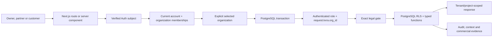
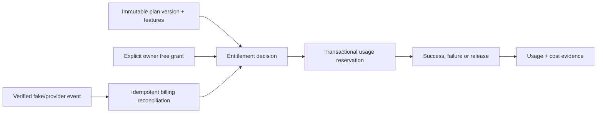
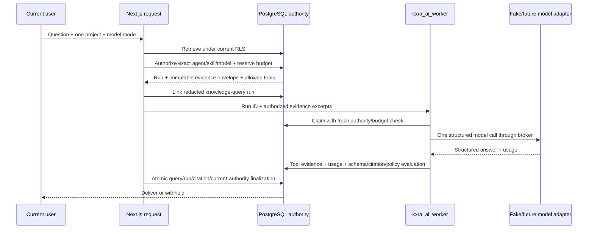
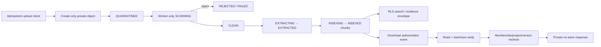
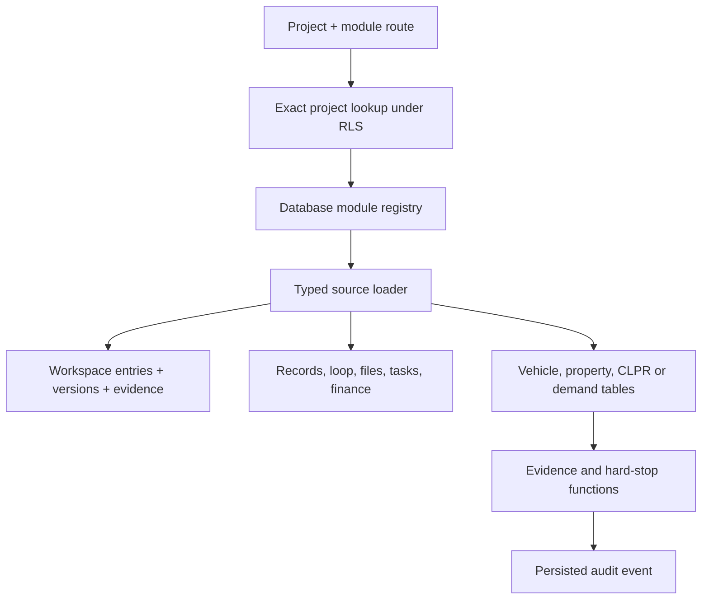
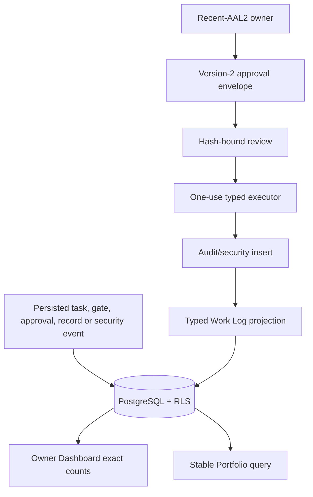

# Implemented architecture

Status: Final Milestones 1–4 and Phase 2 Slices 0–7 are implemented in the deterministic local environment on `codex/phase-2-completion`. Multi-tenant identity, first-private-access legal gating, deterministic commercial/custom-project foundations, the private file/knowledge lifecycle, permission-safe local AI execution, KXRA Brand Studio, governed PROJECT-006/007 local pipelines, the governed local Routine Registry and the transport-disabled WhatsApp authority contract now exist. Hosted providers and the independent public application remain absent. The target architecture is in [Phase Completion Brief 02](../operations/CODEX-PHASE-COMPLETION-BRIEF-02.md); implemented decisions include [ADR 0008](../decisions/0008-multi-tenant-legal-commercial-foundation.md), [ADR 0009](../decisions/0009-secure-file-and-knowledge-lifecycle.md), [ADR 0010](../decisions/0010-permission-safe-ai-execution.md), [ADR 0011](../decisions/0011-kxra-brand-studio-local-product.md), [ADR 0012](../decisions/0012-governed-youtube-and-repository-pipelines.md), [ADR 0013](../decisions/0013-governed-routine-engine.md) and [ADR 0014](../decisions/0014-whatsapp-gateway-authority.md). This document is not hosted or production evidence.

## Trust and request flow



Every handler verifies identity independently. Middleware may refresh hosted cookies but never grants access. The application loads current normalized memberships. A single membership is selected deterministically; multiple memberships require explicit selection. The HttpOnly organization cookie is a selector, not a grant. PostgreSQL revalidates it and records the selection. Database work uses one transaction with `SET LOCAL ROLE authenticated`, server-derived identity claims and one server-derived `request.kxra.org_id`; pooled connections reset afterward. Mutations require the configured same-origin header, strict schemas and bounded input.

The application database login is `NOINHERIT`, `NOBYPASSRLS`, is not a superuser or table owner, and belongs only to the `authenticated` and `anon` roles. There is no browser service-role client. Request bodies, headers, paths, unverified cookies, JWT organization metadata and model output never establish identity, email verification, role, organization, project access, legal acceptance, entitlement, approval or lifecycle state.

## Auth and build boundary

`packages/authz/provider.ts` defines provider-neutral registration, sign-in, email verification, password change/reset, MFA state/challenge/recovery and sign-out-all operations. Supabase remains the production target. The deterministic file-backed provider exists only for local acceptance: it uses scrypt password hashes, digest-only one-use verification/reset tokens and provider session versions.

Package import conditions route local Auth/session/UI modules only when Node resolves the `development` condition. The default production build resolves stubs that reject fixture use. `scripts/verify-production-artifact.mjs` scans the optimized `.next` output for 16 fixture identity, selector, state-file and secret markers. Runtime guards require explicit fixture mode, an HTTP `127.0.0.1` origin, no Vercel or production environment, no hosted Supabase/database combination and generated secrets. Random unprivileged loopback ports support isolated test runs; `localhost`, non-loopback and HTTPS fixture origins fail.

## Invitation and join flow

```mermaid
sequenceDiagram
  participant O as Owner
  participant DB as PostgreSQL
  participant Mail as Fake outbox
  participant B as Partner browser
  participant Auth as Auth provider

  O->>DB: Create email + exact project/role grants + note + expiry
  DB->>Mail: Queue versioned invitation intent
  Mail-->>B: /join#token=opaque-token
  B->>B: Remove fragment immediately
  B->>DB: POST token once; rate limit and hash
  DB-->>B: Encrypted HttpOnly join-intent cookie
  B->>Auth: Create and confirm own password for locked email
  Auth-->>B: Verify email / return
  B->>DB: Redeem exact invitation version atomically
  DB-->>B: Exact memberships + mandatory onboarding
```

The raw invitation token is delivered in a URL fragment, removed with `history.replaceState`, exchanged once, hashed before database lookup and never written to browser storage, application logs, analytics, cookies, API responses or Auth state. The encrypted AES-256-GCM join-intent cookie is HttpOnly, same-site, bounded to 30 minutes and never outlives the invitation. Its payload binds invitation ID/version, token digest, normalized locked email and expiry.

Resend rotates only the delivery version/token and cancels prior pending delivery. The approved grant version remains stable. Material project, role or expiry changes require a replacement invitation and invalidate old links. Redemption locks current state and grants exactly the current invitation rows; mismatch, expiry, revocation and replay fail atomically.

## Account and onboarding model

Invitation states are `PENDING`, `SENT`, `DELIVERY_FAILED`, `REDEEMED`, `EXPIRED` and `REVOKED`. Account states are `INVITED`, `REGISTERED`, `EMAIL_VERIFIED`, `ONBOARDING`, `ACTIVE`, `SUSPENDED` and `REVOKED`. Server-controlled transitions and account security events preserve attribution. `SUSPENDED` and `REVOKED`, inactive organisation membership and inactive/expired project membership override all earlier state.

The onboarding wizard validates nine steps: Welcome, Personal Profile, Security, Project Access, Working With KXRA, optional WhatsApp, Preferences, Terms/Privacy/required agreements and Complete. Project Access is read-only and derived under RLS. Required profile/preferences/agreement data blocks completion. The two legacy seed agreement records remain explicitly labelled `UNAPPROVED_PLACEHOLDER` for local onboarding evidence.

The Slice 1 first-private-access gate is separate and stricter. Only an approved exact legal document/hash may become an active requirement. It stores an immutable presentation snapshot and exact acceptance or decline. A missing current acceptance prevents actor creation and returns `AGREEMENT_REQUIRED` before private routes. A new mandatory version reopens the gate without deleting old evidence. The placeholders have no active requirement and cannot pass the commercial release manifest.

Partners may edit only permitted profile and preference fields, change/reset their provider password, exercise fake MFA/session controls, inspect assignments and unpair their own WhatsApp account. Owner lifecycle and assignment changes bind current state through recent-AAL2, one-use exact approvals. Forced sign-out increments session version. Suspension/revocation removes UI, API, SQL, file, Ask and delivery access immediately.

## Data architecture

One hundred and fifty-one private application tables have RLS and at least one explicit policy. Migrations `0001`–`0053` implement the previously described identity, legal, commercial, file, AI, Brand Studio, seven-project and routine architecture. Migrations `0054`–`0055` add account-bound WhatsApp challenges/pairings, project selections, signed ingress/message/media evidence, takeovers, disabled outbound intents and bounded browser/worker contracts without rewriting prior migrations.

The application exposes 121 bounded functions to authenticated or anonymous roles. Tests enumerate every table and exposed function and fail if either grows without an authorization decision. Composite foreign keys bind organization/project scope. Typed security-definer functions validate context, legal, entitlement, usage, billing reconciliation, custom-project, file/knowledge, AI-run, Brand Studio, YouTube-content, repository-adoption, routine-control and WhatsApp pairing/project-selection transitions; ordinary RLS controls reads. Dedicated file, AI, routine and WhatsApp worker roles receive only their private bounded functions. PROJECT-006 channel verification/disconnection remains private and PROJECT-007 exposes no worker or execution function.

Seed import remains advisory-locked, atomic, source-envelope verified and stable-ID based. Project insertion initializes lifecycle/disposition/gate state, the current governance snapshot, 18 common modules, code-specific specialist modules, gate policy and any bounded static reference rows in the same transaction. Canonical seed import has no real partner grants. Local fixture accounts, exact unapproved legal placeholders and fake outbox examples are separate, deterministic development fixtures.

## Tenant, legal and commercial foundation

`account_identities` is the global identity anchor. `organisation_memberships` assigns one role and relationship to that account in one organization. Legacy `members` and `profiles` remain compatibility projections for existing workflows; they do not authorize a new tenant context. `active_context_events` records successful selections. Removing one membership does not remove another.

The legal model separates source documents, active requirements, presentations, responses and re-acknowledgements. Triggers make presented/accepted evidence immutable. Requirements bind organization, optional membership/relationship audience, exact document/version/hash, exact acceptance wording/version/hash and effective dates. Release manifests must reference approved exact legal and commercial items; a placeholder or missing item fails.

Commercial access is deterministic:



Plans and features are versioned. Billing customers/subscriptions/items/events are normalized. Entitlement decisions return an allow/deny reason and source. Usage reservations lock the effective allowance so concurrent requests cannot exceed it; completion records deterministic units and integer minor-unit cost. Owner free grants carry reason, scope, expiry, issuer and revocation and never fabricate billing subscriptions. The local HMAC verifier and reconciliation function model signed Stripe events, but no public webhook, checkout, customer portal or real price exists.

Custom-project requests are private organization records. Proposal versions bind scope, exclusions, assumptions, milestones, price/currency/tax text, payment gate, legal document hash and expiry. Proposal authors need `custom_project.manage`; customer admins cannot self-price. Acceptance uses the exact current hash. A customer project is created only after the configured payment/deposit gate. Subscription entitlement is never treated as custom delivery authority.

## Existing operating architecture

The typed idea → experiment → assigned task → result → decision → supersession loop remains intact. Owner approvals bind action, organisation, project, complete payload, environment, requester, expiry and current target/access version. Only a current owner with AAL2 issued in the last 15 minutes can approve or execute. `publish`, `spend` and `deploy` have no executor.

All seven projects have explicit evidence-gate policies and can produce only `local_only` authority. Project 001 requires distinct current route, liquidity, recovery, buyer and regulatory evidence. Project 002 requires exact SKU, fitment and safety evidence. Project 003 requires rights and geometry evidence. Project 004 readiness remains paper-only and cannot enable live execution. Project 005 requires reviewed buyer-demand evidence and rejects product creation/publication. Project 006 requires an immutable exact-hash content package, independent complete review and current channel binding, then stops at a disabled upload intent. Project 007 requires exact pinned candidate/quarantine/assessment evidence and an independently approved adoption proposal, then stops at a no-execution implementation intent. Numeric gate thresholds remain `proposed_unset` until an approved scoring policy exists.

Search and Ask KXRA retrieve only through the current principal's RLS transaction. Ask requires exactly one project UUID; missing, null, multiple, inaccessible and revoked scopes fail before retrieval, with no all-project fallback. Explicit inaccessible scopes return the same unavailable result as missing resources. Evidence-only responses contain exact record or indexed-chunk IDs, parent file/record references, classification and version. Model mode is available only through the deterministic local fake adapter: zero evidence returns exactly `INSUFFICIENT KXRA EVIDENCE.` without dispatch, while non-empty evidence enters the typed AI run flow below. External model mode returns a typed unavailable response until a provider is configured. Every query stores a redacted hash and exact authorized references and rechecks current authority before delivery.

## AI execution architecture



The 13 Genesis agents and 12 Genesis skills are imported as typed `DRAFT` manifests. Descriptive definitions do not execute. The only approved local capability is `AGT-ASK`/`SKL-ASK-001`; it has one-project/run memory, no side effects and exactly `knowledge.retrieve` plus `model.generate.structured`. Owner AI Team and Skills screens expose the typed current versions and boundaries. Run History exposes only redacted scope, policy, state, evidence counts, tool calls, usage and failures.

`begin_agent_run` verifies current identity, selected membership/version, legal requirements, project access, exact source versions, classification policy, agent/skill/model version match and a row-locked budget. It creates an immutable envelope and input links before dispatch. The worker role can only claim, record an authorized tool call and finish/fail a run. Documents and model text cannot add a tool. Raw questions and model output are represented by hashes in run evidence rather than copied into the log.

Strict output validation requires one known envelope citation for every claim, rejects duplicate or stale citations and accepts the exact insufficiency response only when the envelope is empty. Ask delivery atomically binds the linked knowledge query to the completed run, rechecks authority plus every cited record/chunk version/hash and marks both delivered or withheld together. Retry is limited to retryable failures and three attempts, and each attempt receives a fresh reservation and its own bounded tool allowance.

The seeded model policy is `LOCAL-FAKE-SOL` and makes no network request. Non-fake policies require a paid reservation. Astra requires a separate approved escalation policy and current `ai.astra_escalate` capability; neither is seeded. External model controls and autonomous handoffs remain unavailable. See [ADR 0010](../decisions/0010-permission-safe-ai-execution.md) and the [AI threat model](../security/ai-execution-threat-model.md).

## Routine execution architecture

The nine Genesis routine definitions are imported as typed manifests and immutable version snapshots. Each version binds an exact SHA-256 hash, trigger type/configuration, timezone/calendar, service identity, organization/project scope, action graph, budget, concurrency key, attempt/backoff policy, lease duration, notification policy and approval state. Every imported version starts `DRAFT`; every manifest starts disabled. Approval requires the expected exact hash, and enablement requires the approved current version.

PostgreSQL plans one logical run per schedule slot or event id. Schedule conversion uses the declared IANA timezone and explicit weekday rules; business and exchange schedules require recorded calendar facts. A worker using only `kxra_routine_worker` can claim an eligible queued run, receive a bounded lease, append checkpoints and complete or fail it. Expired leases are recovered without deleting checkpoints. Requeue rechecks the current manifest, approved version and active service identity; revocation cancels protected retry or delivery.

Run snapshots preserve the exact version and action graph used. Unchanged success is quiet. Changed output requiring review or terminal actionable failure creates one append-only notification intent with `adapter=DISABLED` and `delivery_state=NOT_SENT`. Routine state changes and outcomes feed the existing audit/Work Log projection. The owner UI can inspect definitions and locally plan a reviewed slot, but there is no always-on scheduler process, Trigger.dev task, provider delivery adapter or production worker deployment. See [ADR 0013](../decisions/0013-governed-routine-engine.md), the [routine threat model](../security/routine-engine-threat-model.md) and the [approval/recovery playbook](../playbooks/routine-approval-and-recovery.md).

## Brand Studio architecture

```mermaid
flowchart LR
  Source[Consented supplied source snapshot] --> Profile[Versioned draft brand profile]
  Profile --> ProfileReview[Exact profile decision]
  ProfileReview --> Brief[Versioned campaign brief]
  Brief --> BriefReview[Exact brief decision]
  BriefReview --> Reserve[Database usage reservation]
  Reserve --> Generate[Deterministic local adapter]
  Generate --> Variant[Immutable creative variant]
  Variant --> HumanReview[Brand + claims + rights + accessibility + compliance]
  HumanReview --> Export[Metered private export]
  Export --> Recheck[Current tenant/project/entitlement/content review]
  Recheck --> Download[No-store TEXT / MARKDOWN / JSON]
```



Brand Studio is a tenant tool, while every source, profile, brief, variant and export is bound to one project. The route first resolves the current server-verified actor and project under RLS. Security-definer mutations repeat current write-access and `brand-studio.access` checks. `brand.generate` and `brand.export` use the existing row-locked entitlement and usage-reservation engine; the model or browser never calculates access or quota.

`brand_sources` stores source identity, rights basis and consent. `brand_source_versions` stores the exact supplied text, hash, classification and truthful acquisition/security state. Website URLs must be public HTTPS locators, but the current product does not fetch them: customers paste the source snapshot and the record states `PROVIDER_DISABLED`. This avoids presenting an unimplemented SSRF-safe fetch service as working.

Profiles and campaign briefs use append-only versions. A correction creates a new draft while the previously approved version remains approved until the new exact version is approved. Each inferred profile field links to an exact source version and classification. A campaign binds one approved profile version and cannot generate until its own exact version is approved.

Generation starts only after a successful deterministic reservation. The local adapter accepts bounded typed inputs, makes no network/model call and produces review-required text variants with input hash, adapter/version, channel and lineage. Editing creates a child variant and supersedes the parent; reviewed creative is immutable. An `APPROVE_EXPORT` review requires all five boolean checks to pass and binds the exact content hash. Export creation revalidates the latest exact review and consumes its own usage unit.

Download calls `authorize_brand_export` on every request. It rechecks the current organization membership, project access, export/content/review relationship and current feature entitlement immediately before rendering bytes. Withheld attempts are recorded. Responses are private, `no-store` and `nosniff`; no public object or publication/scheduling endpoint exists. An external generation adapter must later bind an approved model/run policy, source-retention controls and staging budget evidence before activation. See [ADR 0011](../decisions/0011-kxra-brand-studio-local-product.md) and the [Brand Studio threat model](../security/brand-studio-threat-model.md).

## Private file and knowledge lifecycle



The upload RPC derives an opaque key from the verified tenant, project, file and version. A stable request ID makes ambiguous retries idempotent only when filename, MIME, audience, size and hash remain identical. The object store never grants authority. Processing starts after a second server RPC confirms that the immutable write completed.

`file_versions`, state events, scan runs, extraction runs, processing jobs, chunks, delivery events, knowledge-query runs and reconciliation manifests preserve evidence. Chunks carry file and record versions, offsets, hash, extraction adapter/version, classification and audience. Their RLS follows the current parent record and only the current `INDEXED` version is searchable.

The local static scanner/extractor is an adversarial test double. It is size/type bounded and tests executable signatures/extensions, EICAR, archive/macro/active-PDF policy, MIME magic, encoding and JSON. It cannot execute in production or Vercel. Production requires a trusted scanner/signature feed and disposable no-network extraction worker. PDF semantic extraction is unavailable locally; image chunks state verified metadata only.

Reconciliation compares database expectations with private storage, verifies hashes, recovers a uniquely matching orphan, marks missing/mismatched versions failed and moves unknown objects to reconciliation quarantine. Controlled restart tests rehash all registered objects and compare source/chunk/job state. Empty-target restore remains a later gate.

## Project workspace architecture

Each project receives the same 18 common modules from `project_workspace_modules`: Overview, Problem, Customer, Value Proposition, Market, Research, Assumptions, Experiments, Decisions, Risks, Finance, Roadmap, Tasks, Files, Activity, Metrics, Partners and Approvals. The registry then adds 8 specialist modules for Project 001, 12 each for Projects 002 and 003, 13 for Project 004 and 16 for Project 005. Direct routes resolve only module keys present for the authorized project.



Typed workspace entries accept only the payload keys defined for their record type. Evidence-bearing review requires exact current accepted record versions. Partners can create only project-shared entries in projects where they are current contributors; owner-only modules return an explicit denied state without querying their protected data. Crafted nested resource IDs are resolved through fixed SQL maps and must belong to the project in the route.

Specialist state is explicit. Project 002 starts each supported vehicle family at `UNKNOWN` for SKU, fitment and safety and can move to `VERIFIED` only with exact current evidence. Project 003 records `REAL_INPUT`, `AI_GENERATED` or `AI_INFERRED` independently from rights and geometry QA. Project 001 requires five distinct current evidence records for a revisit recommendation or gate packet. Project 004 payload checks force paper-only research and reports and expose no broker, credential, live toggle or executor. Project 005 uses only `DISCOVERY`, `EVIDENCE_REVIEW` and `LOCAL_PROTOTYPE_AUTHORIZED`; gated planning modules expose no mutation controls and there are no creation or publication endpoints.

## Owner control plane



Dashboard sections query complete authoritative sets and use limits only for linked previews. Portfolio sorting uses an allowlist plus project ID as a stable tie-breaker. Actual capital used is grouped by native currency without FX conversion. Venture and Confidence scores, coverage, finance and recommendations remain null/Unknown until reviewed evidence supplies them.

Ideas use a typed record plus versioned sidecar. Generic record APIs reject Idea creation and mutation. Owners see the group-wide inbox. A partner sees a project Idea only when current project access exists and the partner is either its submitter or the recipient of an active explicit share. Project membership alone is insufficient. State transitions and duplicate merges are database-validated; archived Ideas are terminal.

Every newly generated enabled approval uses the canonical states `DRAFT`, `REQUESTED`, `APPROVED`, `REJECTED`, `EXPIRED`, `EXECUTING`, `EXECUTED`, `FAILED` and `RECONCILIATION_REQUIRED`. Envelope version 2 exposes action summary, before/after state, recipient, estimated cost/currency and risk while the digest also binds organisation, project, requester, environment and expiry. External-message, publication, spend, deploy and high-cost-AI actions remain schema vocabulary only and have no executor.

The Work Log is not a free-form register. Triggers project real audit and account-security rows into typed, uniquely sourced entries linked back to records, projects, tasks, approvals, accounts or invitations. Admin is owner-only, logs every view and returns bounded counts, policy state and boolean integration presence; it never returns secret values or a generic database/role editor.

## Email and external services

The local email adapter renders nine versioned templates: Partner Invitation, Invitation Reminder, Password Reset, Email Verification, Welcome, Security Alert, Project Assignment, Access Removed and Approval Required. The outbox has idempotent operation keys and records pending, sent, failed, cancelled and bounced states. The fake transport sends nothing externally.

Hosted Supabase Auth/MFA/session behavior, owner bootstrap, Resend, Stripe, Supabase Storage/scanning, Trigger.dev, OpenAI, Meta WhatsApp, YouTube, GitHub analysis, PostHog, Sentry, Cloudflare and Vercel remain target services only. The current public homepage is a local static route; the separate marketing application and publication boundary belong to later milestones.
