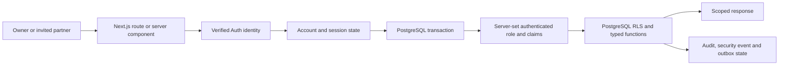
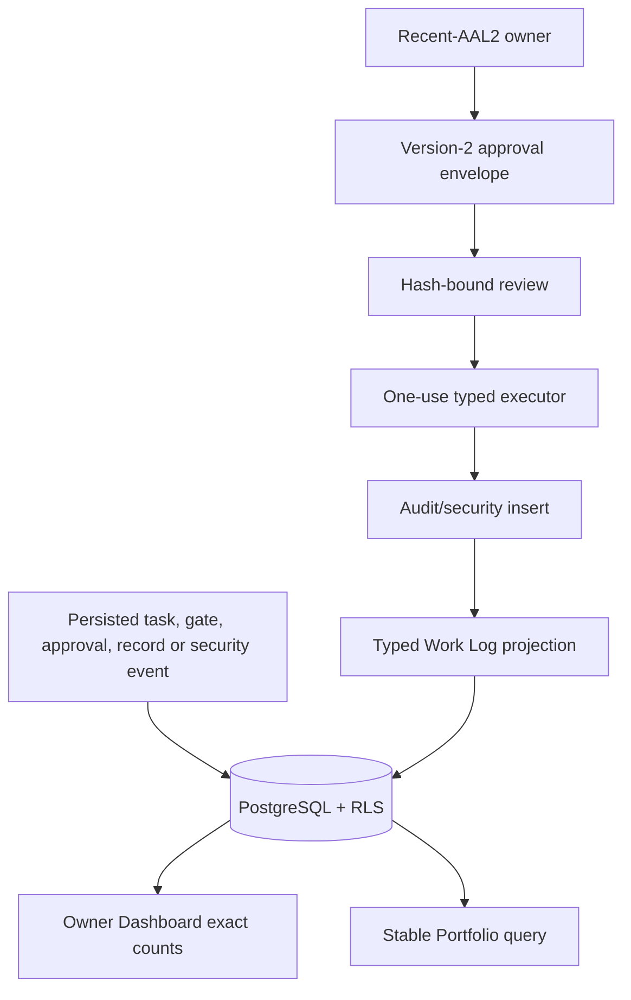

# Implemented architecture

Status: Final Milestone 2 is complete in the deterministic local environment on `codex/phase-2-completion`. The private Genesis brief, Phase Completion Brief and Final Completion Brief remain the cumulative requirements. This is local evidence, not hosted or production evidence.

## Trust and request flow



Every handler verifies identity independently. Middleware may refresh hosted cookies but never grants access. The application checks KXRA account state, current member state, session version and onboarding/agreement readiness before creating an actor. Database work uses one transaction with `SET LOCAL ROLE authenticated` and server-derived claims; pooled connections reset afterward. Mutations require the configured same-origin header, strict schemas and bounded input.

The application database login is `NOINHERIT`, `NOBYPASSRLS`, is not a superuser or table owner, and belongs only to the `authenticated` and `anon` roles. There is no browser service-role client. Request bodies and model output never establish identity, email verification, role, organisation, project access, approval or lifecycle state.

## Auth and build boundary

`packages/authz/provider.ts` defines provider-neutral registration, sign-in, email verification, password change/reset, MFA state/challenge/recovery and sign-out-all operations. Supabase remains the production target. The deterministic file-backed provider exists only for local acceptance: it uses scrypt password hashes, digest-only one-use verification/reset tokens and provider session versions.

Package import conditions route local Auth/session/UI modules only when Node resolves the `development` condition. The default production build resolves stubs that reject fixture use. `scripts/verify-production-artifact.mjs` scans the optimized `.next` output for 16 fixture identity, selector, state-file and secret markers. Runtime guards still require explicit fixture mode, exact loopback origin, no Vercel or production environment, no hosted Supabase/database combination and generated secrets.

## Invitation and join flow

```mermaid
sequenceDiagram
  participant O as Owner
  participant DB as PostgreSQL
  participant Mail as Fake outbox
  participant B as Partner browser
  participant Auth as Auth provider

  O->>DB: Create email + exact project/role grants + note + expiry
  DB->>Mail: Queue versioned invitation intent
  Mail-->>B: /join#token=opaque-token
  B->>B: Remove fragment immediately
  B->>DB: POST token once; rate limit and hash
  DB-->>B: Encrypted HttpOnly join-intent cookie
  B->>Auth: Create and confirm own password for locked email
  Auth-->>B: Verify email / return
  B->>DB: Redeem exact invitation version atomically
  DB-->>B: Exact memberships + mandatory onboarding
```

The raw invitation token is delivered in a URL fragment, removed with `history.replaceState`, exchanged once, hashed before database lookup and never written to browser storage, application logs, analytics, cookies, API responses or Auth state. The encrypted AES-256-GCM join-intent cookie is HttpOnly, same-site, bounded to 30 minutes and never outlives the invitation. Its payload binds invitation ID/version, token digest, normalized locked email and expiry.

Resend rotates only the delivery version/token and cancels prior pending delivery. The approved grant version remains stable. Material project, role or expiry changes require a replacement invitation and invalidate old links. Redemption locks current state and grants exactly the current invitation rows; mismatch, expiry, revocation and replay fail atomically.

## Account and onboarding model

Invitation states are `PENDING`, `SENT`, `DELIVERY_FAILED`, `REDEEMED`, `EXPIRED` and `REVOKED`. Account states are `INVITED`, `REGISTERED`, `EMAIL_VERIFIED`, `ONBOARDING`, `ACTIVE`, `SUSPENDED` and `REVOKED`. Server-controlled transitions and account security events preserve attribution. `SUSPENDED` and `REVOKED`, inactive organisation membership and inactive/expired project membership override all earlier state.

The onboarding wizard validates nine steps: Welcome, Personal Profile, Security, Project Access, Working With KXRA, optional WhatsApp, Preferences, Terms/Privacy/required agreements and Complete. Project Access is read-only and derived under RLS. Required profile/preferences/agreement data blocks completion. Acceptances bind exact agreement ID/version and timestamp. The two seed legal documents are explicitly labelled `UNAPPROVED_PLACEHOLDER`. An active partner missing a newly required agreement is returned to step 8. Successful completion writes `onboarding_completed_at` and activates the account.

Partners may edit only permitted profile and preference fields, change/reset their provider password, exercise fake MFA/session controls, inspect assignments and unpair their own WhatsApp account. Owner lifecycle and assignment changes bind current state through recent-AAL2, one-use exact approvals. Forced sign-out increments session version. Suspension/revocation removes UI, API, SQL, file, Ask and delivery access immediately.

## Data architecture

Thirty-six private application tables have RLS. The original 20 cover organisations, members, projects, memberships, classified records and versions, files, approvals, audit, invitations, operating-loop relations, project gates and disabled WhatsApp ingress. Migrations `0014`–`0021` add profiles, invitation project grants, onboarding progress, user preferences, agreement documents/acceptances, session revocations, transactional email outbox, account security events and durable rate-limit buckets. Migrations `0022`–`0025` add typed Ideas, Idea versions/evidence/shares, project-governance history and real Work Log projections.

The application exposes 52 bounded functions to authenticated or anonymous roles. Tests enumerate every table and function and fail if either grows without an authorization decision. Composite foreign keys bind organisation/project scope. Typed security-definer functions validate consequential workflows; ordinary RLS controls reads.

Seed import remains advisory-locked, atomic, source-envelope verified and stable-ID based. Canonical seed import has no real partner grants. Local fixture accounts, exact unapproved legal placeholders and fake outbox examples are separate, deterministic development fixtures.

## Existing operating architecture

The typed idea → experiment → assigned task → result → decision → supersession loop remains intact. Owner approvals bind action, organisation, project, complete payload, environment, requester, expiry and current target/access version. Only a current owner with AAL2 issued in the last 15 minutes can approve or execute. `publish`, `spend` and `deploy` have no executor.

Projects 002, 003 and 005 retain exact evidence-gate policies and can produce only `local_only` authority. Project 004 rejects live execution and has no broker path. Project 005 rejects product creation/publication. Numeric gate thresholds remain `proposed_unset` until owner-approved evidence exists.

Search and Ask KXRA retrieve only through the current principal's RLS transaction. Explicit inaccessible scopes return the same unavailable result as missing resources. Responses are evidence excerpts with record ID, classification and version; no LLM is called. File bytes remain private quarantine and cannot be downloaded or ingested.

## Owner control plane



Dashboard sections query complete authoritative sets and use limits only for linked previews. Portfolio sorting uses an allowlist plus project ID as a stable tie-breaker. Actual capital used is grouped by native currency without FX conversion. Venture and Confidence scores, coverage, finance and recommendations remain null/Unknown until reviewed evidence supplies them.

Ideas use a typed record plus versioned sidecar. Generic record APIs reject Idea creation and mutation. Owners see the group-wide inbox. A partner sees a project Idea only when current project access exists and the partner is either its submitter or the recipient of an active explicit share. Project membership alone is insufficient. State transitions and duplicate merges are database-validated; archived Ideas are terminal.

Every newly generated enabled approval uses the canonical states `DRAFT`, `REQUESTED`, `APPROVED`, `REJECTED`, `EXPIRED`, `EXECUTING`, `EXECUTED`, `FAILED` and `RECONCILIATION_REQUIRED`. Envelope version 2 exposes action summary, before/after state, recipient, estimated cost/currency and risk while the digest also binds organisation, project, requester, environment and expiry. External-message, publication, spend, deploy and high-cost-AI actions remain schema vocabulary only and have no executor.

The Work Log is not a free-form register. Triggers project real audit and account-security rows into typed, uniquely sourced entries linked back to records, projects, tasks, approvals, accounts or invitations. Admin is owner-only, logs every view and returns bounded counts, policy state and boolean integration presence; it never returns secret values or a generic database/role editor.

## Email and external services

The local email adapter renders nine versioned templates: Partner Invitation, Invitation Reminder, Password Reset, Email Verification, Welcome, Security Alert, Project Assignment, Access Removed and Approval Required. The outbox has idempotent operation keys and records pending, sent, failed, cancelled and bounced states. The fake transport sends nothing externally.

Hosted Supabase Auth/MFA/session behavior, owner bootstrap, Resend, Supabase Storage/scanning, Trigger.dev, OpenAI, Meta WhatsApp, PostHog, Sentry, Cloudflare and Vercel remain target services only. The current public homepage is a local static route; the separate marketing application and publication boundary belong to later milestones.
