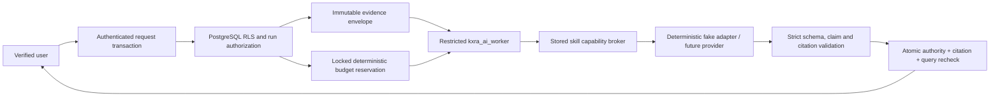

# AI execution threat model

Status: local implementation evidence as of 21 September 2026. This does not approve an external model provider or production deployment.

## Protected assets

- tenant, membership, legal and project authority;
- private records, indexed file chunks and exact source versions;
- model, agent, skill, tool and budget policy;
- provider usage, cost, retry and delivery evidence;
- generated output before current-authority and citation validation.

## Trust boundaries

The browser cannot write AI tables, select a role or invoke worker functions. The web login cannot assume the worker role in production. The worker can execute only four bounded private functions and receives a stored run ID; it cannot widen the initiating tenant/project scope. Model content and retrieved documents are untrusted data.

## Threats and controls

| Threat | Control | Verification |
| --- | --- | --- |
| Crafted tenant/project/user IDs | Server identity plus selected membership; one project is validated under RLS; run scope is copied from database authority | HTTP crafted-project tests and complete principal matrix |
| Cross-project context reaches a model | `begin_agent_run` resolves every exact record/chunk under current RLS and one project before creating the envelope | SQL run isolation and HTTP model-mode tests |
| Prompt or document asks for a stronger tool | Tool set comes only from the approved skill version; broker and worker SQL enforce the same set and call limit | Injection fixture records only `model.generate.structured`; `deploy.production` is denied |
| Draft registry text becomes executable | Run authorization accepts only `APPROVED`, `AUTOMATED` or `MONITORED` versions with matching policy/version | Seed and manifest tests prove only Ask is approved |
| Model invents citations or omits evidence | Strict output schema; every claim needs an envelope citation; unknown, stale, duplicate or unreferenced citations fail | Invalid-output scenario and validator tests |
| Access revoked after retrieval/model call | Worker claim rechecks authority; finalization atomically rechecks membership version, legal requirements, project assignment and each cited source | Pre-claim and post-model revocation tests |
| Concurrent requests exceed budget | Budget policy row lock reserves run, cost and tokens before dispatch | Concurrent reservation test permits one start and releases cancellation exactly |
| Retry bypasses capability or spend controls | Maximum three attempts; retryable failure only; fresh locked reservation; one tool allowance per attempt; linked replay evidence | Timeout/retry test checks two attempts and reservation cycles |
| Provider reports more usage than reserved | Run and reservation enter `RECONCILIATION_REQUIRED`; delivery is withheld | SQL completion contract; external adapter test remains required |
| Worker/provider logs leak prompts or answers | Run tables store hashes and typed metadata, not raw prompt/output; API errors are bounded | Schema inspection and redacted Run History |
| Unknown model is silently substituted | Stored provider/model must equal adapter provider/model; fake adapter rejects mismatch | Unknown-model test |
| Paid model runs with no budget | Non-fake model policy requires nonzero cost reservation; PostgreSQL, not the model, reconciles usage | Database function contract; live-provider test pending |

## Residual and blocked risks

- No external model adapter is connected. Provider zero-retention, data residency, subprocessor, abuse-monitoring, rate-limit, idempotency and invoice reconciliation controls are untested.
- Synchronous local execution is acceptance evidence, not the production queue/recovery design. Trigger.dev leasing, dead-letter handling and crash reconciliation remain missing.
- Raw generated output is not durably retained. This reduces leakage but means production support may need an approved encrypted retention policy and explicit customer-facing history design.
- The Astra escalation rule exists in PostgreSQL, but no approved Astra policy, budget or capability grant is seeded.
- Agent handoff tables exist for future evidence; no handoff mutation function or autonomous delegation workflow is enabled.
- Routines remain definitions only. No scheduler can start a run.
