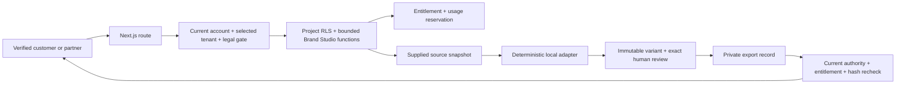

# Brand Studio threat model

Status: local implementation evidence as of 26 September 2026. This does not approve hosted website acquisition, an external generation provider, publication or production deployment.

## Protected assets

- customer source snapshots, rights statements and consent evidence;
- approved brand profile and campaign versions;
- private creative variants, lineage, reviews and exports;
- tenant, project and membership authority;
- entitlement, quota and usage evidence;
- provenance and delivery-withheld audit evidence.

## Trust boundaries

```mermaid
flowchart LR
  User[Verified customer or partner] --> Route[Next.js route]
  Route --> Actor[Current account + selected tenant + legal gate]
  Actor --> RLS[Project RLS + bounded Brand Studio functions]
  RLS --> Reserve[Entitlement + usage reservation]
  RLS --> Source[Supplied source snapshot]
  Source --> Adapter[Deterministic local adapter]
  Adapter --> Review[Immutable variant + exact human review]
  Review --> Export[Private export record]
  Export --> Recheck[Current authority + entitlement + hash recheck]
  Recheck --> User
```

The browser can propose a project ID and product input, but it cannot establish identity, tenant, project authority, entitlement, usage, approval or delivery authority. PostgreSQL derives the organization from the current server identity and checks current project write/read access. Source content and generated creative are untrusted data.

## Threats and controls

| Threat | Control | Verification |
| --- | --- | --- |
| Crafted project or cross-tenant record ID | Route resolves the project under RLS; every mutation repeats organization/project checks in a security-definer function; composite foreign keys bind scope | Crafted P003 partner write returns unavailable; full principal/table matrix and cross-project snapshot tests |
| Viewer or revoked user mutates Brand Studio | Write functions require `can_project(..., true)` and current membership; delivery rechecks current read access | Viewer direct API/database denial; revoked export is withheld |
| Subscription access leaks every project | Entitlement is organization-scoped but records remain project-scoped through RLS | Partner snapshot contains only P002; viewer snapshot contains only P003 |
| SSRF through website URL | HTTPS-only syntax, all-answer DNS and redirect validation, global-address checks, address-pinned hostname-valid TLS, identity encoding and strict time/type/byte limits; the worker is disabled and separately credentialed | Public-web contract, acquisition worker tests and ADR 0026 |
| Unconsented or unsupported source ingestion | Source creation requires explicit consent, non-empty supplied text and rights basis; hosted acquisition remains disabled until its separate staging gate passes | SQL/HTTP source contract and UI copy |
| Inferred profile presented as fact | Profile fields link to exact source version and classification; customer edits create a new version and exact approval is required | Version/evidence lifecycle test |
| Source/profile correction overwrites approved state | Source, correction metadata and profile evidence are append only; each correction binds the exact predecessor and reason; reviewed versions remain immutable | Exact replay/conflict, lifecycle and immutable-trigger tests |
| Stale source lineage approves, generates or exports content | PostgreSQL compares every profile evidence version with the source current pointer before profile/campaign approval, generation start/output, export creation and final delivery | Stale campaign denial, desktop/mobile warning and `SOURCE_EVIDENCE_CHANGED` delivery test |
| Concurrent or excessive generation bypasses quota | `reserve_usage` locks effective entitlement/aggregate before dispatch; success/failure completes or releases units | Commercial concurrency tests plus Brand Studio delta accounting |
| Generated output publishes itself | Adapter only returns structured content; no publication/scheduling route, tool or credential exists | Route inventory, UI test and production scan |
| Edited content reuses an old approval | Edit creates a new child hash and supersedes the parent; review and export bind the exact latest content hash | Edit/review/export lifecycle test |
| Incomplete rights/claims/accessibility review exports | `APPROVE_EXPORT` requires all five strict boolean checks and the latest review ID | Incomplete HTTP review returns conflict; complete review exports |
| Access, entitlement or source evidence changes before download | `authorize_brand_export` rechecks membership, project, exact variant/review/content, current source lineage and export feature; withheld attempts are logged | Entitlement and source-revision withholding tests plus private download HTTP contract |
| Browser causes repeated mutating function evaluation | Mutating composite functions are selected once through `FROM function(...)`, not expanded as `(function()).*` | HTTP profile/campaign decisions complete once; regression is in the full journey |
| Export is cached or interpreted as active content | Response is `private, no-store`, `nosniff`, attachment disposition and typed text/Markdown/JSON | HTTP header/content assertions |

## Residual and blocked risks

- Local tests cover application-level SSRF controls, but hosted DNS, egress enforcement, TLS behavior, proxy behavior and secret custody still require the separate worker staging exercise before acquisition is enabled.
- The local generator is deterministic test/product scaffolding. External provider retention, regional processing, abuse monitoring, prompt policy, rate limits, idempotency, queue recovery, spend caps and invoice reconciliation are untested.
- File-backed brand assets can be registered only through existing private file records; a complete image/video transformation and rights/licence workflow is not implemented.
- Five human checks establish recorded review, not legal or regulatory correctness. Approved policies, sector-specific claims rules and accountable reviewers remain required for production.
- Export delivery is synchronous. Distributed object generation and long-running jobs must re-run authorization immediately before every provider call and byte delivery.
- Customer-facing deletion, retention and portability policy for Brand Studio records awaits approved legal/operational inputs.
